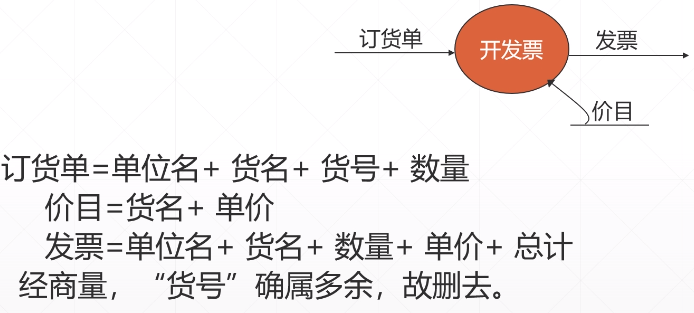

# 需求分析

## 需求分析

### 需求分析的概念

**确定系统必须具有的功能和性能,  系统要求的运行环境, 并且预测系统发展的前景.**

话句话说 **需求就是以一种清晰, 简洁, 一致且无二义性的方式,  对一个待开发系统中各个有意义方面的陈述的一个集合.**

### 修正需求错误的代价

### 需求的获取

* **软件需求获得指的是 如下一个方面**
  * 软件需求的来源
  * 软件工程师收集这些软件需求的**方法**

它也称为 ``**`需求抓取`**, **`需求发现`**和**`需求获得.`**

### 需求的类型

* **功能性需求**
  * 描述系统应该做什么, 即为用户和其他系统完成的功能, 提供的服务.
* **非功能性需求**
  * 限定了解决方案的范围, 如运行平台, 编程语言, 编程工具等,  同时也必须遵循的标准, 外部界面的细节, 实现的约束条件, 质量属性 等.

### 需求来源

* 用户目标
* 知识领域
* 投资者
* 运行环境
* 组织环境

### 需求获取的方式

* **采访**
* **设定情景 \(用例\)**
* **原型**
* **会议**
* **观察商业过程和工作流**

### 需求获取面临的挑战

1. 客户说不清楚需求
2. 需求易变性
3. 问题的复杂性和对问题空间理解的不完备性 与不一致性

#### **经验之谈 和解决方法**  

1. 尽可能地分析清楚哪些是稳定需求,  哪些是易变的需求 .  以便在进行系统设计时, 将软件的核心建筑建立在稳定的需求上, 否则将会吃尽苦头.
2. 在合同中一样要说清楚 "做什么"  和 "不做什么".

### 需求诱导十原则

1. 保持良好的倾听习惯
2. 有准备的沟通
3. 需要有人定期推动
4. 最好当面沟通
5. 记录所有决定
6. 保持通力协作, 不要个人主义
7. 当话题偏题时, 能及时聚焦并协调话题
8. 尽量采用图形表示方式记录需求, 不要存文字
9. 继续前行的原则, 即一旦认为某件事可行, 就继续前行,如果不认可某件事情,也继续前行, 如果有某项特征或功能不清楚, 当时无法澄清 , 也继续前行
10. 谈判双赢原则

## 需求分析的模型

### 需求分析建模概述

* **面向过程分析模型**
  * **`基本思想`** :  用系统工程的思想和工程化的方法, 根据用户至上的原则, 自始至终按照**`结构化,模块化, 自顶向下`** 地对系统进行**分析与设计**.
* **面向对象分析模型**
  * 由 **`5 个层次`** \( **主题层,  对象类层,  结构层,  属性层,  和 服务层** \)  和 **`5个活动`** \(**表示对象类, 表示结构, 定义属性 和 定义服务** \) 组成.

### 分析模型描述工具

### 面向过程分析模型  -- 结构化分析方法

* 面向 **`数据流`** 进行需求分析的方法
* **结构化分析方法适合于** **`数据处理类型软件`** 的需求分析
* 具体来说, 结构化分析方法就是用抽象模型的概念,  按找软件内部 **数据传递,** **变换的关系, `自顶向下`**  **逐层分解, 直到** 找到满足功能要求的所有**可实现的软件为止**.

### 面向过程分析建模工具总览

### 功能模型  -- 数据流图

**数据流图中的主要图形元素 图标:**

### 数据流图图示例

### 数据流图的层次结构

* 在多层数据流图中
  * **`顶层流图`** 仅包含一个加工, 它代表被开发系统.  它的输入流是 该系统的输入数据,  输出流是系统所输出数据.
  * **`中间层流图`**  则代表对其上层父图的细化.  它的每一加工可能继续细化, 形成**子图.**
  * **`底层流图`**  是指其加工不需**再做分解**的数据流图,  它处在最底层

### 绘制数据流图

#### 第一步  绘制数据流图顶层 

* 首先确定系统的 **输入和输出,**  画出顶层数据流图
* 经过分析, 主要数据流 **输入的源点  和 输出终点**  是职工和仓库管理员, 采购员

#### 第二步  绘制数据流图  第1层

* 从输入端开始,  根据仓库业务工作流程, 画出 **数据流** 流经的各加工框, 逐步画到输出端, **得到1层数据流图.**

#### 第三步  绘制数据流图  第2层   加细每一个加工框

**将第1层 中的   每个较为复杂的流程  分别进行细化. \(如果一次分解不够, 那么就再次分解,  这步可以多次进行,  一直细化下去\)**

#### **第四步  合成总体数据流图**

**将上面的所有数据流图进行整合.  可以看到完整的系统工作过程**

#### 第五步  检查与调整数据流图

在分析过程中,  由于每个人的经验和思路不尽相同, 对数据流图的分解方案可以有多种形式, 不是唯一的.  对每一张数据流图 **`进行检查,`** 如果太不平衡, 就需要进行调整, 尽量使分解后的各个软件子系统的复杂性得到平衡,  便于以后设计工作的并行开展.

## 改进数据流图 \(DFD图\)

* **主要工作有三个方面**
  * **一. 检查正确性**
  * **二. 提高易理解性**
  * **三. 重新分解**

### 一. 检查正确性

* 分析员可以从以下几个角度来检查 DFD 的正确性:
  * **数据守恒**
  * **数据存储的使用**
  * **父图和子图的平衡**

#### 数据守恒

**`数据 不守恒`**的情况有**两种**:

1. 某个加工输出的数据并无相应的数据来源,  可能是某些数据流被**`遗漏`**了.  

   

2.  一个加工的输入并没有用到,  这不一定是错误.  可与用户进一步讨论, 是否属于 **`多余`**的数据流.  

#### 数据存储的使用

判断:  是否存在 "**`只读不写"`** 或  "**`只写不读`**" 的数据存储.  \( **注意在`所有的` DFD中检查**\).

### 二. 提高易理解性

* 简化加工之间的联系
* 注意分解的均匀
* 适当的命名

#### 简化加工之间的联系

应**`尽量减少`**加工之间输入输出数据流的**`数目`**. 因为加工之间的数据流越少, 各个加工的功能就越相对独立. 

#### 分解的均匀

**即图中各个部分不均匀.**

一张图中, 如果某些加工已是 **`基本加工(细节),`**  而**`另一些`** 加工还可进一步分解成 **`三,四 层,`** 则应考虑重新分解.

#### 适当的命名

* 名字的意义要明确, 容易理解.
* 如果难以为 DFD 图中的成分 \(数据流, 加工等\) 命名, 往往说明分解不当, 可考虑重新分解.

### 三. 重新分解

在画第N层时意识到在`第 N-1 层` 或 `第N-2层` 所犯的错误,  此时就需要对 `第N-1 层,` 第N-2 层 作 **`重新分解.`**

#### 重新分解的做法  有一下八个步骤

1. 把需要的重新分解的某张图的所有子图连接成一张.

2. 把图分成几部分,  使各个部分之间的联系最少.   , \(把图中的加工重新划分\)

3. 重新建立父图, 即把 **第2步** 所得的每一部分画成一个圆, 而各部分之间的联系就是加工之间的界面.

4. 重新建立个各张子图,  这只需把 **第2步** 所得的图按各部分的**边界剪开即可.**

5. 为所有的加工重新命名和编号     \(重新建立父图并编号\)

### 检查数据流图的原则

1. 数据流图上所有图形符号 **`只限于`** 前述 **`四种`** 基本图形元素.
2. 数据流图的主图 **`必须包括`** 前述四种基本元素, 缺一不可.
3. 数据流图的主图上的数据流必须 封闭在外部实体之间.
4. 每个加工**`至少有`**一个输入数据流和一个输入数据流.
5. 在数据流图中, 需**`按层给加工框编号`**. 编号表名该加工所处层次及上下层的亲子关系.
6. 规定任何一个数据流子图必须与它上一层的一个加工对应,  两者的数据数据流和输出数据流必须一致. **`此即父图与子图的平衡`**.
7. 图上每个元素都必须**`有名字`**.
8. 数据流图中不可夹带**`控制流`**.
9. 初画时可以**`忽略琐碎的细节`**, 以集中经历于主要数据流.

### 功能建模 -- 编写数据字典

编写数据字典, 写出系统需求规格说明书, 提交审查, 并编写测试验收计划, 编写初步的用户手册概要.

主要是根据数据库的规则来建模, 要考虑系统中所有存在的内容, 编码和建模.

## 面向对象的分析方法

### 对象的定义

在现实世界中有意义的, 与所要解决的问题有关系的任何事物都可以作为**`对象`**, 包括具体的物理实体的抽象, 人为的概念, 任何有明确边界和意义的东西.

### 几种著名的面向对象的分析方法

* Booch  方法\(1991\)
* Coad -- Yourdon 方法 \(1991\)
* Rumbaugh 方法 \(简称 OMT\)  \(object Modeling Technology , 1991\)
* Jacobson 方法 \( 简称 OOSE , 1992\)
* 由 Rumbaugh , Booch , Jacobson 提出的同一建模语言 \(简称 **`UML`**\) \(Unify Modeling Language, 1994\)

### 面向对象的软件开发模型

* **数据模型 \(对象模型\):**
  * 描述系统数据结构的对象模型;
* **行为模型 \(动态模型\):**
  * 描述系统控制结构;
* **功能模型**
  * 描述系统功能.

一个典型的软件系统使用**`数据结构`**\(对象模型\), **`执行操作`**\(动态模型\) , 并且完成**`数据值的变化`** \(功能模型\).

## 功能建模 -- 用例图

**用例建模** 用于描述系统需求, 把系统当做黑盒, **`从用户的角度, 描述系统的场景`.** 主要图形元素有以下几个:

* **参与者**  
  * 是指外部用户或外部实体在系统中扮演的角色.  **可以是`一个人, 一个计算机子系统, 硬件设备`** 或者**`时间`** 等 角色.
* **用例**  
  * 对**`一组`**动作序列的描述, 系统通过执行**`这一组动作序列`**为参与者**`产生`**一个可观察的结果.  用例名往往用动宾结构命名.
* **执行关联**  
  * 参与者\(Actor\)  执行用例 \(Use Case\) 之间的关系.

### 用例建模的过程

1. 建立用例模型的**`顺序`**是:
   1. 确定谁会**`直接使用`**该系统. 这些都是参与者 \(Actor\).
   2. 选取其中一个参与者.
   3. 定义该参与者 **`希望系统做什么`** , 参与者希望系统作的每件事称为一个用例.
   4. 对每件事来说,  **`何时`**参与者会使用系统, 通常会**`发生什么`**,  这就是用例的基本过程.
   5. 描述该用例的**`基本过程`**.
   6. **考虑一些可变情况,  把他们创建为`扩展用例.`**
   7. 复审不同用例的描述, 找出其中的相同点, **`抽出相同点`**作为共同的用例.
   8. 重复 2~7 找出每个用例.

### 用例图初步

#### 1. 参与者

* 参与者 \(actor\) 是指系统以外的, 需要使用系统或系统交互的东西, 包括人, 设备 , 外部系统等.
* **参与者的三种表示形式.**

#### 如何确定参与者

* 在获取用例前 **`首先要确定系统的参与者`**, 开发人员可以通过回答以下的问题来寻找系统的参与者.
  * 回答一下问题来寻找系统的参与者.
    * 谁将**`使用`**该系统的主要功能?
    * 谁将**`需要该系统的支持`** 已完成其工作?
    * 谁将需要**`维护,管理该系统`**, 以及保持该系统处于工作状态?
    * 系统需要处理哪些**`硬件设备?`**
    * 与该系统**`交互的是什么系统?`**
    * 谁或什么系统对本系统产生的**`结果感兴趣?`**

#### 2.  用例 \(Use Case\)

* **`用例`的定义**
  * 对**`一组`**动作序列的描述,  系统通过执行**`这一组动作序列`** 为参与者**`产生`**一个可观察的结果.
* **`用例`特征**
  * 说明了系统具有一种行为模型.
  * 说明了一个参与者与系统执行的一个相关的事情序列.
  * 提供了一种获取系统需求的方法.
  * 提供了一种与最终的**`用户`**和**`领域专家`**进行**`沟通的方法.`**
  * 提供了一种**`测试系统`**的方法
* **图形表示**
  * 用椭圆形表示

#### 获取用例

* 参与者希望用户执行什么任务?
* 参与者在系统中访问哪些信息 \(创建,存储,修改,删除等\)?
* 需要将哪些外界信息提供给系统?
* 需要将系统的什么事情告诉参与者?
* 如何维护系统?

#### 系统和关联

* **系统** 
  * 用于界定系统功能范围, 描述该系统功能的用例都置于其中, 而描述外部实体的参与者都置于其外
  * **常用一个矩形框表示**  
* **关联**
  * 连接参与者和用例, 表示参与者所代表的系统外部实体与该用例所所描述的系统需求有关.
  * **常用一条直线表示**   

#### 建立用例模型的顺序是:

1. 确定谁会**`直接使用`**该系统. 那些都是参与者 \(Actor\).
2. 选取其中一个参与者.
3. 定义该参与者**`希望系统做什么,`** 参与者希望系统做的每件事成为一个用例.
4. 对每件事来说, **`何时`**参与者会使用系统, 通常会**`发生什么,`** **这就是用例的基本过程.**
5. 描述该用例的**`基本过程`**.
6. **考虑一些可变情况, 把他们创建为`扩展用例.`**
7. 复审不同用例的描述, 找出其中的相同点,  **`抽出相同点`**作为共同的用例.
8. **重复步骤2 ~ 7  找出每一个用例.**

### 用例图进阶

#### 用例之间的关系

* 关联  \(Association\);
* 泛化  \(inheritance\);
* 包含  \(include;\)
* 扩展  \(extend\).

**`只有`** `关联` **`是参与者和用户之间的通信,  其他三种都是用例与用例之间的通信.`**

#### 1. 关联  \(Association\)

**表示`参与者`与`用例之间`的通信,  任何一方都可发送或接受消息.**

**\[箭头指向\] : `指向消息接受方`   , \(参与者是可以参与多个用例的,由此形成子系统\)**

#### 2. 泛化 \(inheritance\)

就是通常理解的**`继承关系`**, **`子用例`**和**`父用例`**相似, **但表现出更特别的行为**;  **子用例将继承父用例的所有结构, 行为和关系.**  **子用例可以使用父用例的一段行为,  也可以重载它.  父用例通常是抽象的.**

用例之间的 **`is a kind of`** 关系, 表示用例之间的场景共享;  Actor 之间的 **`is a kind of`** 关系, 一般**描述职责共享.**

**`泛化 是用例与用例之间的通信.`**

**\[箭头指向\]**  :   **`由子用例指向父用例 , (是空心箭头指向)`**

#### 3. 包含 \( include\)

包含关系用来把 **`一个较复杂用例`** 所表示的 **`功能分解成较小`**的步骤. 一个用例可以包括另外一个用例.

**`包含 是用例与用例之间的通信.`**

\[**箭头指向**\] : **`由父用例指向子用例, 指向分解出来的功能用例, (因为是分解, 所以是虚线箭头)`**

#### 4. 扩展 \(Extend\)

扩展关系是指用例功能的**`延伸`**, 相当于为基础用例提供一个附加功能. 由一个用例的扩展点 可以**`扩展`**出另外一个用例.

**`扩展 是用例与用例之间的通信.`**

**\[箭头指向\] : `指向基础用例 , (扩展出来的功能,来执行需要扩展的用例), 使用虚线箭头`**

#### 包含 \(include\) , 扩展\(extend\) 的区别:

* 在**`扩展关系`**中, 一个基本用例执行时, **`可以执行`**, **`也可以不执行`** 扩展用例部分.
* 在**`包含关系`**中, 在执行基本用例时, **`一定会执行`**包含用例部分.

#### 关联, 包含, 扩展, 泛化 的区别:

#### 用例实例一 :图书借阅系统用例图

