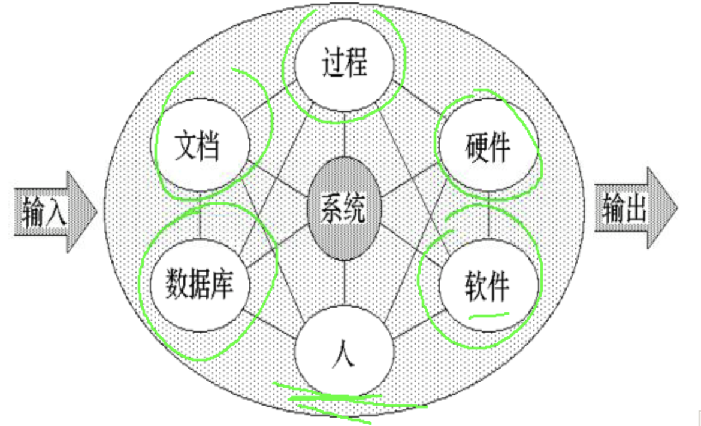
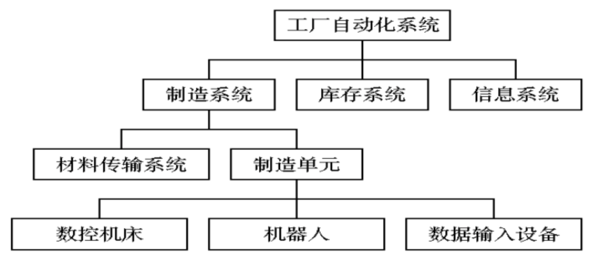
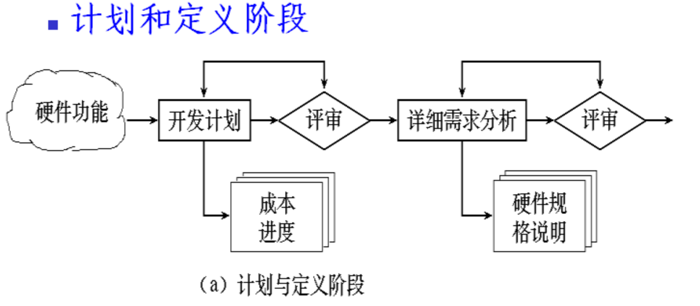
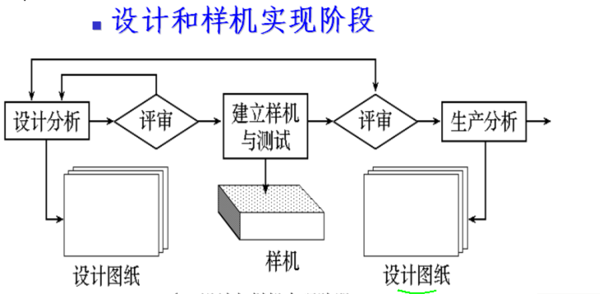
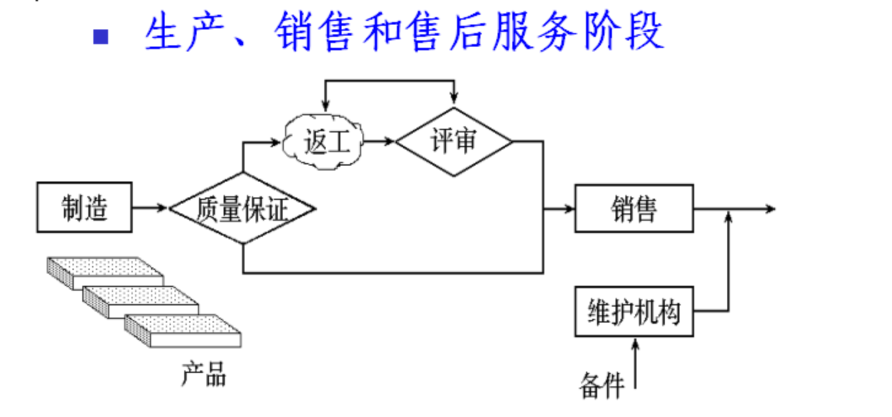
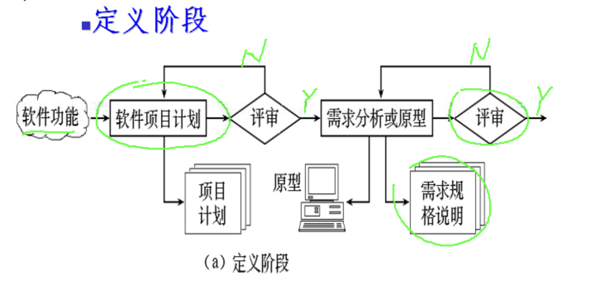
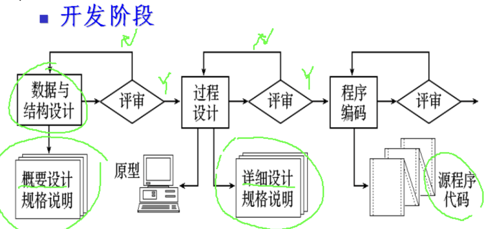
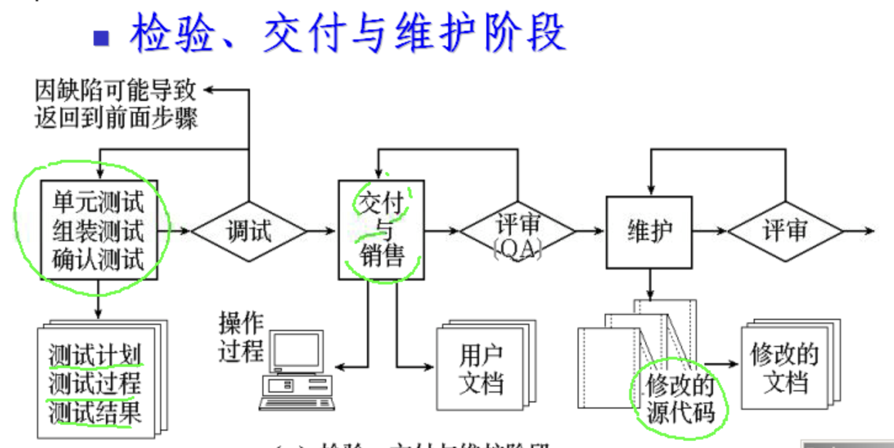

# 废弃-----------系统分析

## 基于计算机的系统

* **某些元素的一个集合或排列;**
* **这些元素被组织起来以实现某种方法, 过程或借助处理信息进行控制.**

### 基于计算机系统的系统元素

* **软件**
  * 计算机程序,  数据结构,  相关文档;
* **硬件**
  * 电子计算设备\(如 CPU, 存储器\)  和外部机电设备 \(传感器, 马达 等\);
* **人**
  * 硬件和软件的用户
* **数据库**
  * 一个大型的有组织的信息集合
* **文档**
  * 手册 , 表格 和 其他用以描述系统使用和操作的信息
* **过程**
  * 定义每一种系统元素的**`特定使用步骤`**, 或系统驻留的过程性环境

### 工厂自动化系统

## 计算机系统工程

计算机系统工程是一个 **`问题求解活动`**,  目的是**`揭示, 分析`** 所期望的功能,  并把它们分配到各个单独的系统元素中去.

### 系统工程师的任务

* 与用户合作确认 **用户的目标和约束;**
*  **`导出功能, 性能, 接口, 设计约束 和 信息结构的 表示;`**
* 将他们分配到每一个系统元素中;

### 硬件和硬件工程

* 计算机系统工程师  **`选择硬件的某种组合`** 以 **`构成基于计算机系统的硬件元素`**
* 硬件工程过程可分为三个阶段
  * **`计划和定义阶段;`**
  * **`设计和样机实现阶段;`**
  * **`生产, 销售和售后服务阶段.`**

#### 计划和定义阶段

#### 设计和样机实现阶段

#### 生产, 销售和售后服务阶段

### 软件与软件工程

* **为实现要求的功能和性能, 必须制作或获取一系列软件部件;**
* **软件工程过程可分为三个阶段**
  * **`定义阶段;`**
  * **`开发阶段;`**
  * **`检验, 交付与维护阶段.`**

### 人与人类工程

* **是应用心理学和方法论 导出的知识来确定和设计`高质量人机对话界面 (HCI)`  的多学科活动.**
* **人类工程过程包括如下步骤**
  * **`活动分析`  ---  环境交互及划分任务, 进行任务分析;**
  * **`语义分析和设计` ---  动作精确定义, `对话`设计.**
  * **`语法和词法设计` --- 各个动作和命令的形式, 硬件与软件实现;**
  * **`用户环境设计` ---  将硬件, 软件和其它系统生成元素组合起来形成用户环境;**
  * **`原型` ---  从人的角度出发来评价 界面\(HCI\);**

### 数据库和数据库工程

* **数据库工程 \( `包括数据分析, 设计 和 实现`**\);
* **对于使用数据库的系统,  `信息仓库 往往是所有功能的核心;`**
* **数据库工程的应用是在数据库的信息域定义完成之后;**

## 系统分析的目标和过程

* 识别用户要求;
* 评价系统的可行性;
* 进行经济分析和技术分析;
* **把功能分解给 `硬件, 软件, 人,  数据库  和其他系统元素;`**
* 建立成本和进度限制;
* 生成系统规格说明,  形成所有后续工作的基础.

## 可行性研究  \(重点\)

### 可行性研究的概念

* 回答是否可行
  * **最短时间;**
  * **最小代价;**
* 一下几个方面的可行性
  * **技术可行性:** **`开发的风险,  资源的有效性,  技术;`**
  * **经济可行性;**
  * **操作可行性;**
  * **法律可行性;**

### 可行性研究的步骤

* 复查系统的规模和目标;
* 研究正在使用的系统;
* 导出新系统的高层逻辑模型;
* 重新定义问题;
* 导出和评价供选择的方法;
* 推荐性的方针;
* **书写文档提交审查;  \(可行性研究报告\)**

### 可行性研究的结果  -- 可行性报告

* **报告应该包括的内容**
  * **`项目背景;`**
  * **`管理概要与劝告;`**
  * **`候选方案;`**
  * **`系统描述;`**
  * **`经济可行性;`**
  * **`技术可行性;`**
  * **`法律可行性;`**
  * **`用户使用可行性;`**
  * **`推荐方案及理由; (重要)`**  
  * **`性能的标准;`**

## 成本 和 效益分析

### 成本估计

#### 代码行技术

* **估计代码行数;**
* **用 每行代码的平均成本  乘以   代码行数; \(还有没有开发, 只能估计\)**

#### 任务分解技术

**把软件开发工程  `分解成若干` 各项独立的任务.  再分别估计`每个单独的开发任务的成本`, 最后累加起来得出软件开工程的`总成本`**.

#### 自动估计成本技术

* **采用自动估计成本的软件工具估计成本;**
* **`必须有长期搜集的大量 历史记录数据 为基础;`**

#### 成本/效益分析的方法

* **货币的时间价值 --- 用利率表示**
  * \*\*\*\*$$F = P(1+i)ⁿ  --- F是P元钱存入银行n年后的价值;$$ ****
  * \*\*\*\*$$P=F/(1+i)ⁿ  ---  未来收入 F 元, 换算为的今天为 P元;$$ ****
* **投资回收期**
  * 投资回收期就是使累计的经济效益等于最初投资所需要的时间;
* **纯收入**
  * 纯收入是在整个生存期之内的系统的累计经济效益 \(折成现在值\)  与投资之差;

