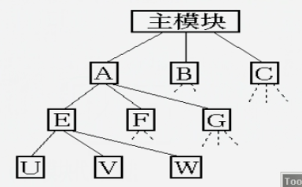
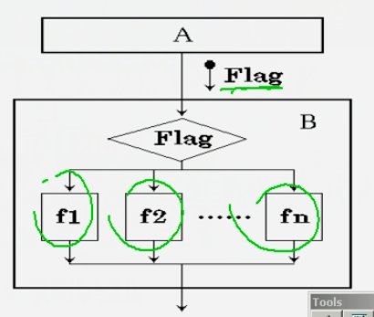
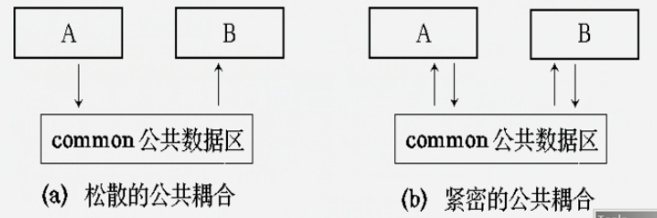
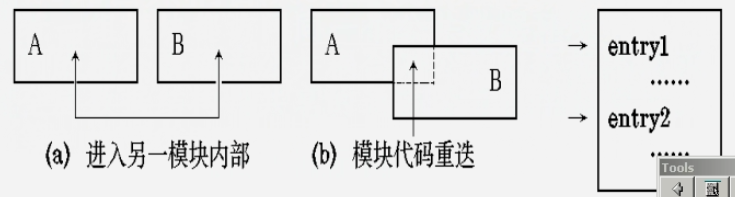
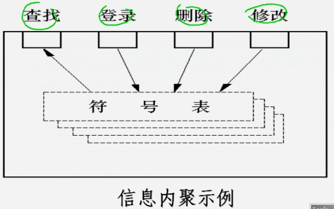
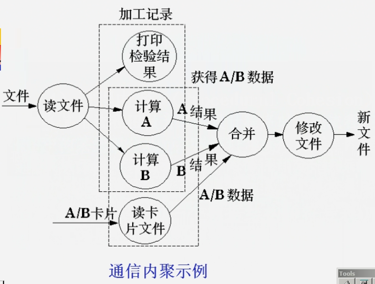
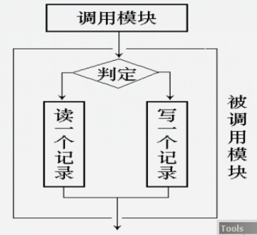
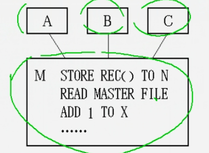
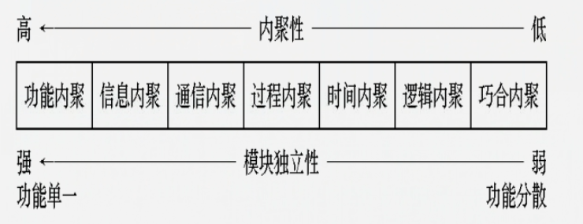
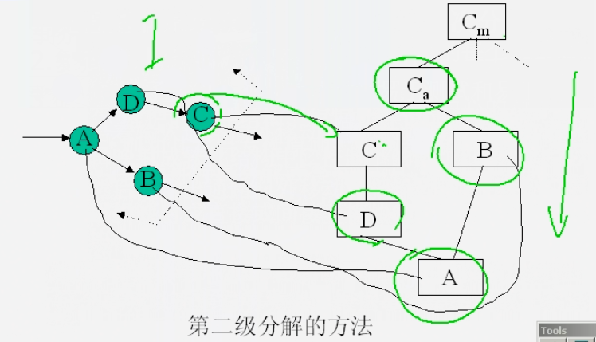

# 废弃-----------总体设计

## 总体设计的任务

* **总体设计的任务是确定软件的体系结构和数据库结构.**
  * 划分出组成系统的物理元素 - 程序, 文件, 数据库, 人工过程和文档等等;
  * **设计软件结构**,  即 确定系统中每个程序由那些模块组成, 以及这些模块之间的相互关系.

## 总体设计的过程

### 1. 设想供选择的方案

* **在数据流程图的基础上**, 一个边界一个边界设想并列出供选择的方案. 通常,选取的这些方案中至少应包括 **低成本, 中成本和高成本** 的三种方案类型;
* **对每个合理的方案要提供一下几个方面资料:**
  * **`系统流程图;`**
  * **`数据字典;`**
  * **`成本 / 效益分析;`**
  * **`实现这个系统的进度计划.`**

### 2. 选取合理的方案

* 从上一步得到的一系列提供选择的方案中选取若干个合理的方案, 通常至少选取低成本, 中成本 和 高成本的三种方案 ;
* 根据系统分析确定的目标,  来判断那些方案是合理的;

### 3. 推荐最佳方案

* 综合分析对比各种合理方案的利弊, 推荐一个最佳的方案, 并为最佳方案制定详细的实现计划.

### 4. 功能分解

* 对分析结果进一步细化,  在进行功能分解.

### 5. 设计软件结构

* **软件结构反映系统中模块的相互调用关系:**  顶层模块调用它的下层模块以实现程序的完整功能,  每个下层模块在调用更下层的模块, 最下层的模块完成具体的功能.
* 软件结构通过层次或结构图来描绘, 可以直接从数据流程图映射出软件结构. 

### 6. 数据库设计

**数据库设计是一项专门的技术,  包括`模式设计, 子模式设计, 完整性和安全性设计, 以及优化处理等`**

### 7. 指定测试计划

在软件开发的早期阶段提前考虑软件的测试计划是很有必要的.  这样能促使软件设计人员在设计时注意到软件的测试问题, **从而有利于提高软件的可测试性.**

### 8. 书写文档

* 文档包括:
  * **系统说明;**
  * **用户手册;**
  * **测试计划;**
  * **详细的实现计划;**
  * **数据库设计结果;**

### 9. 审查和复审

* **后管理审查;**
* **先技术审查;**

## 软件设计基础

### **一.** 模块

**模块是数据说明, `可执行语句` 等程序对象的集合,  它是单独命名的 而且可通过名字来访问,  例如`, 过程, 函数, 子程序,宏 等等 都可以作为模块.`**

### 1. 模块化

**即把软件划分为`可独立命名和编址的部件`, 每个部件称为一个`模块`, 每个模块完成一个`子功能`,  当把所有模块组装到一起称为一个`整体`时`, 便可以完成指定的功能`.**

### **2. 理想模块**

* **理想模块的特点**
  * `每个理想模块只解决一个问题; (`**`高内聚`**`)`
  * `每个理想模块的功能都应该明确, 使人容易`**`理解`**`;`
  * `理想模块之间的联结关系简单, 具有`**`独立性; (低耦合)`**
  * `由理想模块构成的系统,` **`容易使人理解, 易于编程, 易于测试, 易于修改和维护`**`;`
* **对用户来说, `其感兴趣是模块的功能`, 而不必去理解模块内部的结构和原理;**

### **3. 模块化的理论根据**

#### **1. 对于相互独立的问题**

#### **2. 对于相互不独立的问题**

**有关联的比没有关联的更加耗费时间,工作量也大,  所以模块还是设计为 相互独立最好**

#### 3. 模块化和软件成本的关系

**模块也不是越多越好, 接口也不是越少越好, 凡事有平衡.**

### 4. 采用模块化原理的优点:

* **可以使软件结构清晰, 容易设计, 容易阅读和理解, 容易测试和调试**;
* **`提高软件的可靠性;`**
* **`有助于软件开发工程的组织管理`**,  一个复杂的大型程序可以由许多程序员分工编写不同的模块, 并且可以进一步分配技术熟练的程序员编写困难的模块;

### 二. 抽象化

* **软件系统进行模块设计时, 可有不同的抽象层次;**
* **在`最高`的抽象层次上, `可以使用问题所处环境的语言概括的描述问题的解法;`**
* **在`较低`的抽象层次上, `则采用过程化的方法.`**

### **1. 过程的抽象**

**在软件工程中, 从系统定义到实现, 每进展一步都可以看做是对软件解决方法的抽象化过程的一次细化.**

* **软件需求分析过程, 用 "问题所处环境的为大家所熟悉的术语" 来描述软件的解决方法**
* **从概要设计到详细设计的过程中, 抽象化的层次逐次降低.  当产生源程序时到达最低抽象层次\(源程序\).**

### **2. 数据抽象**

**在不同层次上描述数据对象的细节, 定义与该数据对象相关的操作.**

### **三. 信息隐蔽**

**`信息隐藏`是指,`每个模块的实现细节对于其他模块来说是隐蔽的`. 也就是说,模块中所包含的信息 \(包括数据和过程\) 不允许其他不需要这些信息的模块使用.**

\*\*\*\*

### **四. 模块独立性**

* **模块独立性, 是指软件系统中每个模块只涉及软件要求的具体子功能, 而和软件系统中其他的模块的接口是简单的;**
* **`若一个模块只具有单一的功能且与其他模块没有太多联系, 则成此模块具有模块独立性.`**
* **一般采用两个准则度量模块独立性.  即模块间 `耦合`和`模块内聚.`**

### **1. 耦合**

* **`耦合` 是模块之间的相互连接的紧密程度的度量;**
* **耦合程度取决于各个模块之间`接口的复杂程度, 调用模块的方式`以及`哪些信息通过接口`;**
* **一般有七种类型的耦合:**
  * **非直接耦合 \(Nondirect Coupling\)**
    * 两个模块之间没有直接关系他们之间的联系完全是通过主模块的控制和调用来实现的.
    * 非直接耦合的模块独立性最强.  

      
  * **数据耦合 \(data Coupling\)**
    * 一个模块访问另一个模块时, 彼此之间是通过**`简单数据参数(不是控制参数,公共数据结构或外部变量)`** 来交换输入, 输出信息的;
  * **标记耦合 \(Stamp Coupling\)**
    * 一组模块通过参数表传递**`记录信息`**, 就是标记耦合. 这个记录是某一数据结构的子结构, 而不是简单变量.  \(比数据耦合更复杂\)
  * **控制耦合 \(control Coupling\)**
    * 如果一个模块通过**`传送开关, 标志, 名字 等控制信息`**, 明显的控制选择另一模块的功能, 就是控制耦合.  

      
  * **外部耦合 \(External Coupling\)**
    * 一组模块都访问**`同一全局简单变量`** 而不是同一全局数据结构, 而且不是通过参数表传递该全局变量的信息, 则称之为外部耦合.
  * **公共耦合 \(Common Coupling\)**
    * 若一组模块都访问 **`同一个公共数据环境`**, 则他们之间的耦合就称为公共耦合.  `公共的数据环境可以是`**`全局数据结构, 共享的通信区, 内存的公共覆盖区`**`等.`
    * 公共耦合的复杂程度随耦合模块的个数增加而显著增加, 若只是两模块间有公共数据环境, 则公共耦合有两个情况.  **`松散公共耦合  和 紧密公共耦合.`**  
  * **内容耦合 \(content Coupling\)**
    * 如果发生下列情形, 两个模块间就发生了内容耦合:
      * 一个模块直接访问另一个模块的内部数据;
      * 一个模块不通过正常入口转到另一模块内部;
      * 两个模块有一部分程序代码重叠;
      * 一个模块有多个入口.  

        

**模块独立性比较强的模块 应是 `低耦合`的模块.**

### **2. 内聚**

* ~~**`内聚`**~~ **是模块功能强度 \(一个模块内部各个元素彼此结合的紧密程度\) 的度量;**
* **内聚是信息隐藏和局部化概念得到自然扩展, 它标志一个模块内部各成分彼此结合的紧密程度;**
* **`内聚也分为七个等级`**
  * **功能内聚\(Functional Cohesion\)**
    * 一个模块中各个部分都是 **`完成某一具体功能`** 比不可少的组成部分, 或者说该模块中所有欧部分都是为了完成一项具体功能而相同工作, 紧密联系, 不可分割的. 则称该模块为**功能内聚模块.**
  * **信息内聚 \(Informational Cohesion\)**
    * 这种模块 **`完成多个功能, 各个功能都在同一数据结构上操作`**, 每一项功能有一个唯一的入口点, 这个模块将根据不同的要求, 确定执行哪一个功能.  由于这个模块的所有功能都是基于同一个 **数据结构\(符号表\)**, 因此, 他是一个信息内聚的模块.  

      
  * **通信内聚 \(communication Cohesion\)**
    * 如果一个模块内各功能部分都使用了相同的**`输入数据,`** 或产生了相同的**`输出数据`**, 则称之为通信内聚模块.  **通常,通信内聚模块是通过数据流图来定义的.**  

      
  * **过程内聚 \(Procedural Cohesion\)**
    * 使用流程图作为工具设计程序时, **`把流程图中的每一部分划出组成模块,`** 就得到过程内聚模块. 例如,把流程图中的循环部分,判定部分,计算部分 分成三个模块, 这个三个模块都是过程内聚模块.
  * **时间内聚 \(Classical Cohesion\)**
    * 时间内聚又称为**`经典内聚,`**这种模块大多为多功能模块, 但模块的各个功能的执行与时间有关, **`通常要求所有功能必须在同一时间段内执行`**. 例如**`初始化模块和终止模块`**.
  * **逻辑内聚 \(Logical Cohesion\)**
    * 这种模块把集中相关的功能组合在一起, 每次被调用时,由传送给模块得判定参数来确定该模块应执行哪一种功能.  

      
  * **巧合内聚 \(Coincidental Cohesion\)**
    * 当模块各部分之间没有联系, 或者即使有联系,  这种联系也很**`松散`**, 则称这种模块为 **巧合内聚模块**,  **`它是内聚程度最低的模块.`**  

      

**模块独立性比较强的模块应是`高内聚`的模块.**

## 总体设计准则

### 一. 模块的分解

* **分解是指把一个模块分解成若干个从属它的下层模块.**  **模块具有较高的独立性**;
* **模块功能单一**.  一般按功能分解, 分解成为一个小的功能单一的模块为止;
* 一般一个模块内包含的语句在 30~50 条左右比较好\(指高级语言\).

### 二. 模块的深度, 宽度, 扇出和扇入

* 模块的**`深度`**表示软件结构中控制的**`层数`**;
* 模块的**`宽度`** 是软件结构内**`同一个层数上`**的模块总数的`最大值;`
* 模块的**`扇出`** 指一个模块拥有的**`直属下级模块`**的个数, 一般扇出数控制在7以内;
* 模块的**`扇入`** 是指一个模块的直接上级模块的个数;
* 经验证明, 一个设计的很好的软件模块接结构, **`通常顶层扇出比较高,`** **`中层扇出比较少,`** **`底层模块有高扇入`**.

### 三. 模块的控制范围和判断作用范围

* **模块的控制范围**:  本身及其所有下级模块; \(包括直接和间接的所有模块\)
* **模块的判断作用范围:**  被判断调用的模块;
* **`原则:`**
  * **`A. 对于任何一个内部存在判断调用的模块, 它的判断作用的范围应该是其控制范围的一个子集;`**
  * **`B. 存在判断调用的模块, 所在层次不要与那些属于判断作用范围的模块所在的层次相隔太远.`**

### 四. 力争降低模块接口的复杂程度

* **`模块接口复杂是软件发生错误的一个主要原因`.  应该仔细设计模块接口, 使得信息传递简单并且和模块的功能一致;**
* **接口复杂或不一致 \(即看起来传递的数据之间没有联系\), 是紧联结或低聚合的征兆, 应该重新分析这个模块的独立性.**

### **五. 设计单入口单出口的模块**

* **不要使模块间出现内容耦合.**

### **六. 模块功能应该可以预测**

* **`只要输入的数据相同, 就产生同样的输出,` 这个模块的功能就是可以预测的;**
* **模块的功能应该能够预测, 但也要防止模块功能过分局限.**

\*\*\*\*

## 图形工具

### 一. 层次图 \(H图\)

**层次图用来描绘软件的`层次结构.`**

**在层次图内,  使用  `方框表示模块 , 连线表示模块与模块之间的相互关系.`**

### 二. HIPO 图

**`HIPO图是  "层次图加输入/处理/输出图" 的英文缩写.`  它在层次图里除了最顶层的方框之外, 每个方框都加了`编号`.  以具有追踪性.**

### 三. 结构图

* **一个`方框`代表一个`模块`**, 框内注明模块的名字和主要功能;
* **`方框之间的箭头表示模块的调用关系;`**
* **`尾端`带有`空心圆`的`短箭头`表示`数据信息`, `尾端`带有`实心圆`的`短箭头`表示`控制信息.`**

## 面向数据流的设计方法

### 一. 概念

### 1. 变换流

**信息沿输入`通路进入系统`,  同时由`外部形式变换成内部形式,` 进入系统的信息`通过变化中心`, 经过`加工处理以后`再沿着`输出通路`变换成`外部形式`离开软件系统.**

**当数据流具有这些特征时, 这种信息流称为`变换流`.**

**特点: 从同一数据源进入系统的数据, 它在数据流图中流动的逻辑路径是相同的.**

### 2. 事物流

数据沿疏输入通路到达一个 **事物中心\(处理中心\)** , **`这个处理根据输入数据的列项在若干个动作序列中选出一个来执行`.**  这种"**以事物为中心**"  的数据流, **称为事物流;**

* 事务中心 完成以下任务 : 
  * **接受输入数据;** 
  * **分析每个事物已确定它的类型;**
  * **根据事物类型选取一跳活动通路.**

### 3. 设计过程

### 二. 变换分析

* 复查基本系统模型;
* 复查并精华数据流图;
* 确定数据流图具有变换特征还是事物特征;
* **确定`输入流`和`输出流`的边界, 从而孤立出 `变换中心`;**
  * **检查 "输入流" 的边界;**
  * **检查 "输出流" 的边界;**
  * **得到变换中心.**
* **完成 "第一级分解"**

  

* **完成 "第二级分解"**
  * 所谓第二级分解就是把数据流图中的 **每个处理映射成软件结构中** 一个**适当的模块.**
  * **完成第二级分解的方法:**
    *  ****从变换中心的边界开始, `沿着输入通路向外移动`, 把输入通路中的每个处理逻辑映射成软件结构中 **Ca** 控制下的一个`底层模块;` 
    *  然后眼输出通路向外移动, 把输出通路中的每个处理逻辑映射成直接或间接接受模块 **Ce** 控制的一个底层模块;
    * 最后把变换中心内的每个处理映射成受 **Ct** 控制的一个模块.  

      
* **使用模块的设计原则, 对第一次分割得到的软件结构进一步精化.**
  * 为了得到一个易于实现, 易于测试 和 易于维护 的软件爱你结构, 根据软件设计的基本原则和其他启发性原则, 对初步分割得到的模块进行再分解或合并.

#### 例子1

#### 例子2

### 三. 事务分析

* 事务分析的设计步骤和变换分析的设计步骤大部分相同或类型,  主要差别仅在由数据流图 到软件结构的映射方法不同.  由事物流 映射成的软件结构包括一个接收分支和一个发送分支.
* 映射出 **接受分支** 结构的方法和变换分析映射出输入结构的方法类似,  即从事务中心的边界开始, 把沿着接收流通路的处理逻辑映射成模块.
* **发送分支**的结构包括一个**调度模块,** 它控制下城的所有活动模块,  然后把数据流图中的每一个活动流通路径映射成与它的特征相对应的结构.

与变换分析一样,  事务分析也是从分析数据流图开始, 自顶向下, 逐步分解, 建立系统的结构图.  这里取下图所示的数据流图为例, 说明事物分析设计方法的步骤:

* 首先建立主模块用以代表整个加工;
* 然后考虑第二模块.  第二模块只能是三类 : **取得事物, 处理事务 和 给出结果.**

在上图中, 依据并列的三个加工, 在主模块之下建立了三个事物模块, 分别完成 L,M 和N 的工作.  并在主模块的下沿以菱形引出这三个事物模块的选择,  而在这些事物模块的左右两边则是对应于加工 I 和 O 的 "取得A" 模块 和 "给出 H" 模块.

### 四. 总结

* 对于一个大系统, 常常把变换分析 和 事物分析应用到同一个数据流图的不同部分,  由此得到的子结构形成 "构件" , 可以利用它们构造完整的软件结构;
* 一般来说, 如果数据流不具备有显著地事务特点, 使用变换分析; 反之, 如果具有明显的事务中心, 则应该采用事务分析技术

## 总体设计说明书

### 一.引言

### 二. 总体设计

### 三. 接口设计

### 四. 运行设计

### 五. 系统数据结构设计

### 六. 系统出错处理设计

